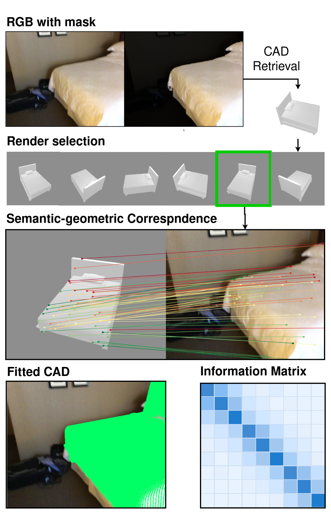

<h1 align="center">🥊 SUFLECA 🥊</h1>

Release code for **SUFLECA**, a fast and accurate weakly supervised algorithm for fitting CAD models to images.

This repo provides the inference and evaluation stack: the SUFLECA feature extractor, the alignment code, the single-view evaluator on ScanNet25k, and a zero-shot demo notebook.

> **Scope.** We release the trained models along with the code to run and evaluate them. The training and data-preparation code are not planned to be released.

## Pipeline

Given a single RGB image and an instance mask, SUFLECA fits a CAD model in a few stages:

1. **CAD retrieval.** The masked object is used to retrieve a matching CAD model from the pool.
2. **Render selection.** Among precomputed renders of that CAD, the closest viewpoint to the image is selected.
3. **Semantic-geometric correspondence.** SUFLECA features establish dense correspondences between the image and the selected render.
4. **Fitted CAD.** Robust estimation (SupeRANSAC) recovers the pose and scale, and the fitted CAD is overlaid on the image. An information matrix captures the confidence of the fit.

<p align="center">
  
</p>

## System

Tested configuration:

| Component | Version |
| --- | --- |
| OS | Ubuntu 24.04 LTS |
| GPU | NVIDIA RTX 5090 (32 GB) |
| NVIDIA driver | 580.x |
| CUDA | 12.8 |
| Python | 3.10 |
| PyTorch | 2.8.0+cu128 |

The cu128 PyTorch build is required for Blackwell / RTX 50-series GPUs. On older GPUs use the matching CUDA wheel instead.

## Setup

`scripts/create_env.sh` builds the whole environment (conda): a Python 3.10 env with the cu128 PyTorch build, the vendored SupeRANSAC binding, SUFLECA, SAM2, and the zero-shot notebook dependencies.

```bash
cd ~/SUFLECA
bash scripts/create_env.sh    # creates a conda env named "sufleca"
conda activate sufleca
```

The DUNE encoder loads via `torch.hub` on first use, so the machine needs network/cache access for the weights. The demo notebook additionally pulls SAM2 and the public `Ruicheng/moge-2-vitl` depth model on demand, plus the gated DINOv3 weights (`facebook/dinov3-vitl16-pretrain-lvd1689m`). Accept the terms, then `hf auth login` (or use a pre-populated Hugging Face cache).

## Artifacts

All data lives under `data/`, including generated CAD render assets under `data/render_pool_<checkpoint>/`. The tracked `data/model_names.txt` file lists the ShapeNet CAD models used for the Scan2CAD render pool, one `<synset>/<model_id>` entry per line.

The **render pool is generated locally** (it is too large to distribute): see [Generating the render pool](#generating-the-render-pool) below. Only the compact artifacts are downloaded:

| Artifact | Local path | Source |
| --- | --- | --- |
| SUFLECA checkpoints | `checkpoints/` | released |
| Scan2CAD / ScanNet25k data | `data/ScanNet25k/` | released |
| Render pool | `data/render_pool_<checkpoint>/` | **generated** |
| CAD centers JSON | `data/cad_orig_centers.json` | **generated** |
| DINOv3 zero-shot template index | `data/zero_templates/dinov3/` | **generated** |

The checkpoints and ScanNet25k archives are distributed with the release. Extract each one so the repo ends up with this layout:

```
checkpoints/{sufleca,sufleca-small,sufleca-wo-scannet}/{best.pt,config.json}
data/ScanNet25k/{Images,Dataset,full_annotations.json}
```

Unzip the checkpoints archive into `checkpoints/` and the ScanNet25k archive into `data/` (its top-level entry is `ScanNet25k/`, so it lands at `data/ScanNet25k/`).

Expected checkpoint config files:

| Variant name | Checkpoint path | Config path |
| --- | --- | --- |
| `sufleca` | `checkpoints/sufleca/best.pt` | `checkpoints/sufleca/config.json` |
| `sufleca-small` | `checkpoints/sufleca-small/best.pt` | `checkpoints/sufleca-small/config.json` |
| `sufleca-wo-scannet` | `checkpoints/sufleca-wo-scannet/best.pt` | `checkpoints/sufleca-wo-scannet/config.json` |

## Generating the render pool

The render pool is built from ShapeNetCore.v2 (scripts in `scripts/`). The CADs are listed in `data/model_names.txt` (`<synset>/<model_id>` per line). The SAPIEN/trimesh rendering dependencies are installed by `scripts/create_env.sh` (the `render` extra).

### ShapeNet meshes

The renderer reads meshes from `<shapenet-root>/<synset>/<model_id>/models/model_normalized.obj`, the standard ShapeNetCore.v2 layout.

1. Register and accept the terms at <https://shapenet.org> (ShapeNetCore.v2 is also mirrored on Hugging Face at [`ShapeNet/ShapeNetCore`](https://huggingface.co/datasets/ShapeNet/ShapeNetCore)).
2. Download ShapeNetCore.v2 and extract it so `--shapenet-root` points at the directory containing the per-synset folders below.

Only the nine Scan2CAD evaluation categories are needed. You can download just these synset archives rather than the full dataset:

| Synset ID | Render category | `evaluation/eval_sv.py` label |
| --- | --- | --- |
| `02747177` | trash bin | bin |
| `02808440` | bathtub | bathtub |
| `02818832` | bed | bed |
| `02871439` | bookshelf | bookcase |
| `02933112` | cabinet | cabinet |
| `03001627` | chair | chair |
| `03211117` | display | display |
| `04256520` | sofa | sofa |
| `04379243` | table | table |

These IDs are the single source of truth in three places that must stay in sync: `CAD_TAXONOMY` in `evaluation/eval_sv.py`, `SYNSET_TO_CATEGORY` in `scripts/render_cads.py`, and the `synsets:` block in `configs/zero_shot_sv.yaml`. `data/model_names.txt` only lists models from these synsets.

### Build steps

A single wrapper runs all three steps: render → cache SUFLECA features (`scores.npz` + `clean_XX.npz`) → collect per-CAD bbox centres:

```bash
scripts/build_render_pool.sh \
    --shapenet-root /path/to/ShapeNetCore.v2 \
    --checkpoint sufleca --workers 4
```

Only `--shapenet-root` is required. `--model-names`, `--render-pool`, `--cad-centers`, and `--overwrite` are overrides (`--help` for the full list). The underlying `render_cads.py`, `precompute_render_pool.py`, and `build_cad_centers.py` can also be run individually.

By default this yields a compact alignment pool, per CAD under `data/render_pool_<checkpoint>/<synset>/<model_id>/` (for example, `data/render_pool_sufleca/`):

```
metadata.json                precomputed/scores.npz
precomputed/clean_XX.npz
```

RGB renders, masks, and pointmaps are generation intermediates. They are deleted CAD-by-CAD as soon as both cache tiers have been written successfully. Evaluation enumerates views from `scores.npz`, not from render filenames. Pass `--keep-raw` to `build_render_pool.sh` only when those intermediates are needed for inspection or another preprocessing job.

The pool name and cache metadata are checkpoint-specific. `eval_sv.py` derives `data/render_pool_<checkpoint>` from `run.checkpoint` when `--render-pool` is omitted, and cache loading rejects a different checkpoint. If `--render-pool` is overridden manually, it must point to a pool generated with the same checkpoint.

The evaluator does not recompute render features on the fly: step 2 must be run whenever the checkpoint, image size, or view set changes. The cached `meta` block records the `checkpoint` and `image_size`, and stale caches are ignored automatically.

### Zero-shot template index

The optional **zero-shot** retrieval pipeline needs its own template index, built by `scripts/build_zoom_templates.sh`. This is self-contained: it renders 48 zoomed-in partial-object views per CAD (separate from the alignment render pool's canonical views) at retrieval size 256, featurizes them with DINOv3, and streams the staging renders away one synset at a time so peak disk stays bounded to a single category:

```bash
scripts/build_zoom_templates.sh \
    --shapenet-root /path/to/ShapeNetCore.v2 \
    --synsets 03001627 --workers 6
```

Omit `--synsets` to build all nine categories. This writes `data/zero_templates/dinov3/<synset>/{singles.npy, index.json, dense/, meta.json}`, the coarse descriptors and on-demand dense patch features used by `sufleca.zero_shot`. Retrieval runs at size 256 (the templates) while alignment runs at size 448 (the render-pool feature caches). Both are fixed in `configs/zero_shot_sv.yaml`.

## Evaluation

`configs/sufleca.yaml` holds only the algorithm settings: the model `checkpoint` plus the `image_processing`, `ransac`, and `correspondence` blocks. Everything run- and data-related is a CLI argument of `evaluation/eval_sv.py`. All ScanNet25k-internal paths (image root, masks, alignments, val split, full annotations) are derived from a single `--scannet25k` dataset root.

Run with defaults, or override paths and run settings on the CLI:

```bash
python evaluation/eval_sv.py --config configs/sufleca.yaml

python evaluation/eval_sv.py \
  --config configs/sufleca.yaml \
  --scannet25k data/ScanNet25k \
  --render-pool data/render_pool_sufleca \
  --cad-centers data/cad_orig_centers.json \
  --phase metrics --output-dir runs/eval_sv_test --overwrite
```

`--limit` caps scenes and `--max-targets` caps target entries for quick diagnostics. Per-target failures are logged with scene/frame/instance context and the run continues. By default the evaluator uses the bundled ROCA per-frame detections (`<scannet25k>/Dataset/roca_per_frame.json`) and matching `roca_sam_masks/`. Pass `--roca-per-frame` for a different detections JSON. Select the checkpoint variant (`sufleca`, `sufleca-small`, `sufleca-wo-scannet`) via `run.checkpoint` in the config.

**Note on workers.** `--workers` parallelizes across scenes, but every worker shares the single GPU, so raising the count oversubscribes it past the point where feature extraction saturates the device. Multi-GPU sharding would be straightforward to add (partition scenes across devices) but is not currently implemented.

**Note on reproducibility.** GPU feature extraction and RANSAC are not deterministic run-to-run, so accuracy fluctuates slightly between identical runs.

## Zero-Shot Demo

`demo.ipynb` runs the full pipeline on a single image at `examples/chair1.jpg`, given the locally generated `data/render_pool_sufleca/` and `data/zero_templates/dinov3/` (see [Generating the render pool](#generating-the-render-pool)). Pick a prompt mode at the top: `interactive` (drag a box in the notebook) or `grounding_dino` (`IDEA-Research/grounding-dino-base`, box from a text prompt). It then masks with SAM2, writes metric depth with MoGe-2, gates the label through `configs/zero_shot_sv.yaml`, retrieves the CAD with DINOv3, and calls `align_single_view`, ending with the aligned CAD overlaid on the image and a 3D visualization.

The overlay and 3D view default to the sparse precomputed render-frame points, so they need no extra assets. To overlay the dense original CAD mesh instead, set `SHAPENET_ROOT` in the setup cell to your ShapeNetCore.v2 root. The mesh is then sampled via each render's `metadata.json`.

The retrieval strategy is adapted from [OSCAR: Open-Set CAD Retrieval from a Language Prompt and a Single Image](https://arxiv.org/abs/2601.07333), dropping OSCAR's VLM/caption stage: the SV vocabulary gates the category, DINOv3 single-template descriptors produce a coarse shortlist, and DINOv3 dense patch descriptors rerank it before alignment.

## Attribution

SUFLECA uses the vendored SupeRANSAC C++/pybind implementation in `third_party/superansac` for robust 3D-3D rigid transform estimation. SupeRANSAC ([danini/superansac](https://github.com/danini/superansac)) is authored by Daniel Barath and released under the MIT License. The license is included at `third_party/superansac/LICENSE`.
